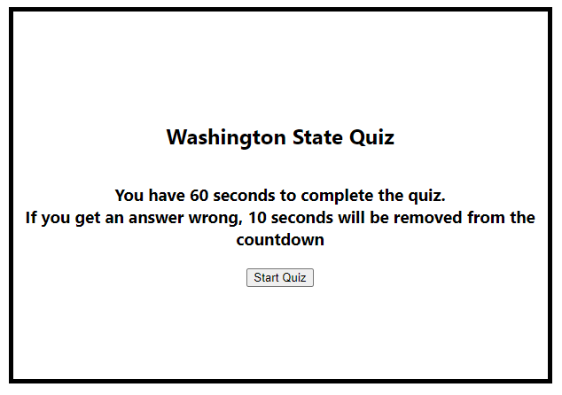

`<Your-Project-Title>`{=html}
=============================

Washington State Quiz

Description
-----------

A quiz of 5 questions on Washington State.

Provide a short description explaining the what, why, and how of your
project. Use the following questions as a guide:

-   What was your motivation? I was motivated to learn more about
    JavaScript and get more experience in writing code
-   Why did you build this project? (Note: the answer is not "Because it
    was a homework assignment.") On top of learning more and gaining
    more experience, I wanted to create a web based quiz
-   What problem does it solve? It provides a fun way to learn about the
    state of Washington
-   What did you learn? I learned how to store and pull data from local
    storage. I also learned how to properly use event listeners.

Table of Contents (Optional)
----------------------------

If your README is long, add a table of contents to make it easy for
users to find what they need.

-   [Installation](#installation)
-   [Usage](#usage)
-   [Credits](#credits)
-   [License](#license)

Installation
------------

Follow the link below to access the quiz. No installation required.
https://wabarringer.github.io/quiz/

Usage
-----

After hitting the "Start Quiz" button you will be presented with 5
questions, one at a time. You have 60 seconds to finish all questions.
If you answer incorrectly there will be 10 seconds subtracted from the
countdown timer.


``` {.md}

```

Credits
-------


n/a


License
-------

n/a

------------------------------------------------------------------------
